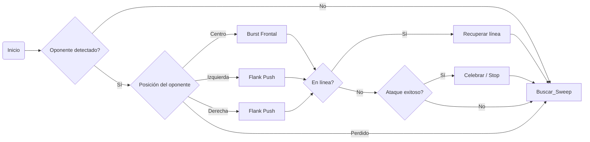

# 🥋 Kaizen Dōjō Mini Sumo – Strategy Module (Extended Edition)
> 💭 *“El código no se improvisa, se entrena. Cada función es un kata, cada parámetro una decisión.”*  

## Descripción general
Este módulo implementa las estrategias de combate (katas) del robot mini sumo autónomo usado en el *Kaizen Dōjō Experience 2025*.
Cada kata representa una rutina de ataque o búsqueda, inspirada en la filosofía japonesa de monozukuri —crear con precisión, propósito y disciplina.
El robot combina sensores JS40F (detección de oponente) y QTR-1A (detección de línea) con control mediante Arduino Nano y drivers integrados en la placa oficial del workshop.


---

### 📁 Descripción de carpetas

- **`src/`** – Código fuente principal del robot mini-sumo.  
  - `main.ino` – Programa principal para Arduino.  
  - `motors.h / motors.cpp` – Control de motores y movimiento.  
  - `sensors.h / sensors.cpp` – Lectura de sensores QTR, ultrasónicos, etc.  
  - `strategy.h / strategy.cpp` – Módulo de estrategias de ataque y defensa (Kata).  

- **`docs/`** – Documentación del equipo.  
  - `bitacora_equipo.md` – Registro Kaizen de mejoras, pruebas y aprendizajes.  

- **`README.md`** – Guía de uso, parámetros configurables y créditos del proyecto.

---
```css
mini_sumo_kaizen_v2/
│
├── src/
│   ├── main.ino
│   ├── motors.h / motors.cpp
│   ├── sensors.h / sensors.cpp
│   ├── strategy.h / strategy.cpp   ← (este módulo)
│
├── README.md                       ← guía de uso y parámetros
└── docs/
    └── bitacora_equipo.md          ← registro de iteraciones Kaizen
```


## Mapa FSM


## Parámetros configurables
| Parámetro | Descripción | Valor por defecto | Rango |
|------------|-------------|------------------|--------|
| POWER_HIGH | Potencia de ataque | 230 | 200–255 |
| POWER_MED | Potencia media | 140 | 100–180 |
| POWER_LOW | Potencia de búsqueda | 90 | 70–120 |
| BURST_DURATION_MS | Duración ataque frontal | 300 | 200–600 |
| RETREAT_MS | Tiempo de retroceso | 350 | 200–500 |
| SWEEP_ANGLE_MS | Tiempo de giro de búsqueda | 400 | 300–600 |
| WAIT_STRIKE_MS | Tiempo de espera en contraataque | 250 | 100–400 |
| SPIRAL_STEP_MS | Paso de radio en espiral | 200 | 150–300 |

## Ciclo Kaizen
1. 🧪 Prueba una kata 10 veces  
2. 📊 Mide resultados  
3. 🔧 Ajusta parámetros  
4. 🧘‍♂️ Reflexiona  
5. 🔁 Itera hasta dominarla

> “No cambies todo, cambia una cosa hasta dominarla.” — *Filosofía Kaizen*

