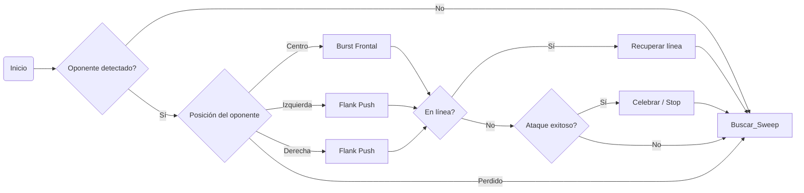

# 🥋 Kaizen Dōjō Mini Sumo – Strategy Module (Extended Edition)
> 💭 *“El código no se improvisa, se entrena. Cada función es un kata, cada parámetro una decisión.”*  

## Descripción general
Este módulo implementa las estrategias de combate (katas) del robot mini sumo autónomo usado en el *Kaizen Dōjō Experience 2025*.
Cada kata representa una rutina de ataque o búsqueda, inspirada en la filosofía japonesa de monozukuri —crear con precisión, propósito y disciplina.
El robot combina sensores JS40F (detección de oponente) y QTR-1A (detección de línea) con control mediante Arduino Nano y drivers integrados en la placa oficial del workshop.

```css
mini_sumo_kaizen_v2/
│
├── src/
│   ├── main.ino
│   ├── motors.h / motors.cpp
│   ├── sensors.h / sensors.cpp
│   ├── strategy.h / strategy.cpp   ← (este módulo)
│
├── README.md                       ← guía de uso y parámetros
└── docs/
    └── bitacora_equipo.md          ← registro de iteraciones Kaizen
```
🧠 Filosofía del módulo

Cada kata es una máquina de estados finitos (FSM) autónoma.
El robot fluye entre ellas según su percepción y contexto:
```css
[SEARCH] → [ATTACK] → [CHECK LINE] → [RECOVER] → [SEARCH]
                     ↑
                     └──── [STRATEGY SELECTOR]
```

Los estados están conectados por condiciones sensoriales (detección de línea, oponente o pérdida de contacto).
El selector de estrategia decide qué kata ejecutar en función de:
- la posición del oponente,
- la lectura de sensores,
- o el modo DIP configurado por el equipo.


## Mapa FSM


##🥋 Catálogo de Katas disponibles

| Nivel        | Nombre de Kata                         | Propósito                                   | Activación recomendada         |
|--------------|----------------------------------------|---------------------------------------------|-------------------------------:|
| Básica       | `kata_burst_frontal()`                 | Ataque directo rápido                       | Detección central activa      |
| Básica       | `kata_sweep()`                         | Barrido lateral de búsqueda                 | Sin detección durante > 1 s   |
| Básica       | `kata_retreat_and_ram()`               | Retirada y contraataque                     | Contacto prolongado           |
| Intermedia   | `kata_flank_push()`                    | Ataque desde flancos                        | Detección lateral             |
| Intermedia   | `kata_spiral_drive()`                  | Aproximación en espiral                     | Detección intermitente        |
| Intermedia   | `kata_stop_wait_strike()`              | Espera táctica y ataque                     | Rival impulsivo               |
| Avanzada     | `kata_torque_burst()`                  | Control adaptativo de par                   | Combate prolongado            |
| Avanzada     | `kata_fakeout_pounce()`                | Finta y emboscada                           | Rival agresivo                |
| Avanzada     | `kata_adaptive_pressure()`             | Ajuste dinámico de agresividad              | Combates extensos             |
| Experimental | `kata_cooperative_rim_lift()`          | Empuje con torsión controlada               | —                             |


## Parámetros configurables
| Parámetro | Descripción | Valor por defecto | Rango |
|------------|-------------|------------------|--------|
| POWER_HIGH | Potencia de ataque | 230 | 200–255 |
| POWER_MED | Potencia media | 140 | 100–180 |
| POWER_LOW | Potencia de búsqueda | 90 | 70–120 |
| BURST_DURATION_MS | Duración ataque frontal | 300 | 200–600 |
| RETREAT_MS | Tiempo de retroceso | 350 | 200–500 |
| SWEEP_ANGLE_MS | Tiempo de giro de búsqueda | 400 | 300–600 |
| WAIT_STRIKE_MS | Tiempo de espera en contraataque | 250 | 100–400 |
| SPIRAL_STEP_MS | Paso de radio en espiral | 200 | 150–300 |

##🧩 Integración en el loop principal

Ejemplo mínimo de uso en main.ino:
```cpp
#include "strategy.h"

void setup() {
  strategy_init();
}

void loop() {
  execute_strategy();
}
```


Cada kata puede activarse/desactivarse desde el código o mediante un menú de control DIP:
```
set_kata_enabled("burst_frontal", true);
set_kata_enabled("flank_push", false);
```

## Ciclo Kaizen
1. 🧪 Prueba una kata 10 veces  
2. 📊 Mide resultados  
3. 🔧 Ajusta parámetros  
4. 🧘‍♂️ Reflexiona  
5. 🔁 Itera hasta dominarla

> “No cambies todo, cambia una cosa hasta dominarla.” — *Filosofía Kaizen*

